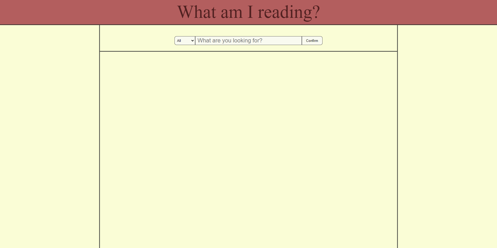
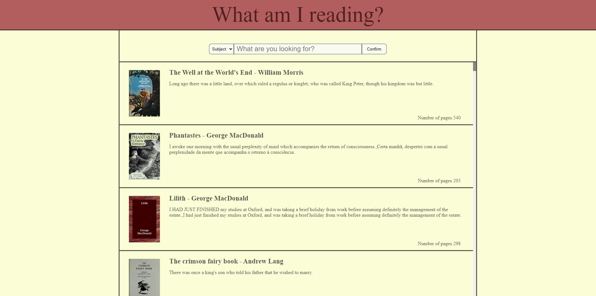
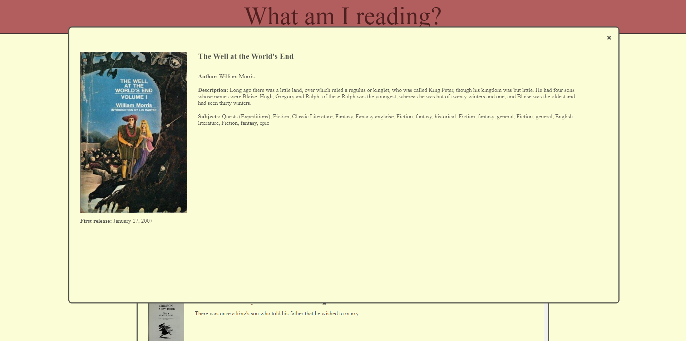

# What am I reading
 
<strong>What am I reading</strong> is a web app that helps the user search for books and their description.

To use it, simply enter the genre, author or title of the book you want to search in the text box provided, selecting on the side the type of search you want to conduct.

This will bring us back a list of books (only the first 100 search results will be displayed) pertaining to the search made. The various books will be contained in a special paragraph listing the title, author, a first sentence and the number of pages of the book; flanked on the left by the cover image (should it be missing, a javascript function will fill the space with a graphic of a generic cover).

Once you have located the book of interest, clicking on it will bring up a panel containing more information about it.
